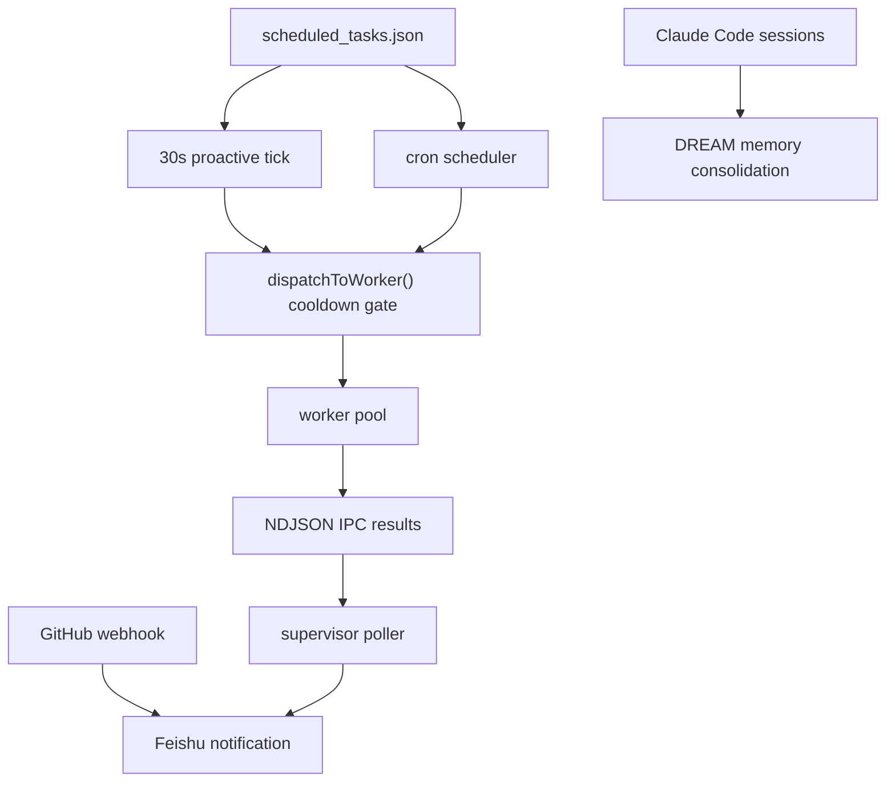

# KAIROS

[](https://github.com/Zzhplayer/KAIROS/actions/workflows/ci.yml)
[](LICENSE)

> Proactive agent daemon for scheduled OSS maintenance workflows.
>
> 主动式 Agent daemon，让 AI 可以按计划、按事件、按维护上下文主动行动，而不是只等待一次性指令。

KAIROS is a long-running Bun/TypeScript daemon that connects coding agents to real maintainer workflows: cron tasks, GitHub pull request webhooks, Feishu notifications, worker isolation, and DREAM-style memory consolidation.

The project is early, but its goal is practical: help small open-source maintainers automate repetitive maintenance loops such as issue triage, PR summaries, release notes, security review reminders, and daily project memory updates.

## Use Cases

- Scheduled maintainer tasks: run repeatable prompts on cron schedules.
- GitHub PR awareness: receive opened, closed, merged, and review events.
- Release support: summarize project activity into changelog and release-note drafts.
- Security hygiene: keep webhook secrets, local daemon behavior, and worker boundaries visible for review.
- Project memory: consolidate important decisions from coding-agent sessions into local notes.

## Features

- **Scheduled task execution** - cron expressions dispatch prompts to worker processes.
- **Feishu notifications** - task success and failure can be pushed to a group or user.
- **GitHub webhook server** - PR lifecycle events can trigger maintainer notifications.
- **Proactive heartbeat** - a 30-second tick keeps the daemon aware of due work.
- **Worker pool** - supervisor/worker split keeps task execution isolated.
- **DREAM memory consolidation** - daily extraction of decisions and lessons from Claude Code sessions.

## Install

```bash
git clone https://github.com/Zzhplayer/KAIROS.git
cd KAIROS
bun install
```

KAIROS requires Bun 1.2 or newer.

## Quick Start

### Configure Scheduled Tasks

Edit `~/.claude/scheduled_tasks.json`:

```json
[
  {
    "id": "daily-report",
    "prompt": "Analyze today's git commits and write a short project maintenance summary.",
    "schedule": "0 9 * * *",
    "permanent": true
  }
]
```

### Start The Daemon

```bash
KAIROS_ENABLED=true bun run daemon
```

### Start The Webhook Server

```bash
bun run webhook
```

### Configure Feishu Notifications

KAIROS reads Feishu bot credentials from `~/.openclaw/openclaw.json`:

```json
{
  "channels": {
    "feishu": {
      "enabled": true,
      "appId": "cli_xxxxxx",
      "appSecret": "xxxxxx"
    }
  }
}
```

Set the notification target:

```bash
export KAIROS_FEISHU_NOTIFY_ID="oc_YOUR_REAL_FEISHU_ID"
```

## Environment Variables

| Variable | Default | Description |
| --- | --- | --- |
| `KAIROS_ENABLED` | `false` | Set to `true` to start the daemon. |
| `KAIROS_FEISHU_NOTIFY_ID` | - | Feishu group or user target, such as `oc_xxx` or `ou_xxx`. |
| `KAIROS_WORKER_COUNT` | `2` | Number of worker processes. |
| `KAIROS_HEARTBEAT_INTERVAL_MS` | `30000` | Heartbeat and proactive tick interval. |
| `KAIROS_CRON_JITTER_MS` | `60000` | Max cron jitter in milliseconds. |
| `KAIROS_DREAM_INTERVAL_MS` | `86400000` | DREAM consolidation interval. |
| `KAIROS_GITHUB_WEBHOOK_SECRET` | - | GitHub webhook HMAC secret. |
| `KAIROS_GITHUB_APP_INSTALLATION_ID` | - | Optional GitHub App installation id used for loop protection. |

## Architecture



## Project Structure

```text
src/
  entrypoints/cli.tsx              CLI entry point
  daemon/supervisor.ts             Main supervisor
  daemon/worker.ts                 Worker process
  daemon/ipc.ts                    File-based IPC
  daemon/cronScheduler.ts          Cron scheduler
  daemon/dreamScheduler.ts         DREAM scheduler
  daemon/webhookServer.ts          GitHub webhook server
  proactive/index.ts               Heartbeat and tick controller
  services/autoDream/              Session memory consolidation
  utils/                           Cron, task config, Feishu, logging helpers
```

## Maintainer Workflow

This repository is maintained in the open. See:

- [Contributing guide](CONTRIBUTING.md)
- [Security policy](SECURITY.md)
- [Agent instructions](AGENTS.md)
- [Changelog](CHANGELOG.md)

## License

MIT
